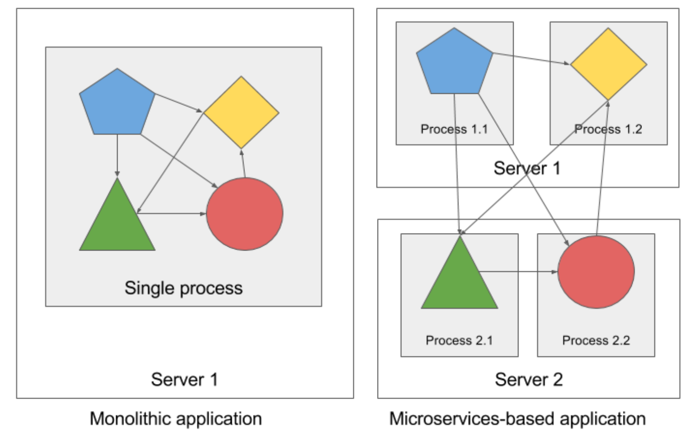
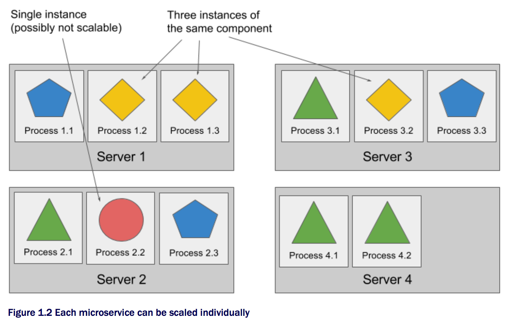
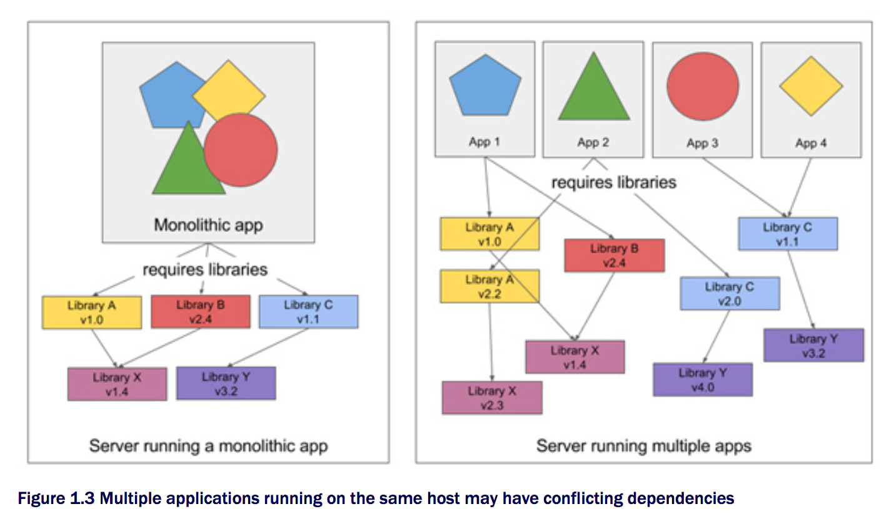

# Chapter 1 - Kubernates 소개

## 1.1 Kubernates와 같은 시스템의 필요성
기존 커다란 단일(Monolithic) 형태의 응용프로그램에서 마이크로서비스(Microservices) 형태로의 변화됨에 따라 인프라 구성 또한 영향을 미치게 되었음.

단일 응용프로그램은 여러 컴포넌트들이 단단히 서로 연결되어져 있으며, 단일 OS 프로세스로서 실행되기때문에 이들은 하나의 개체(Entity)처럼 개발, 배포 그리고 관리되어져야 한다. 또한 이는 각 컴포넌트간 명확한 접점 혹은 종속성 부족으로 인하여, 한 부분의 변경은 모든 재배포를 의미하게된다.

일반적으로 단일 응용프로그램을 실행하기 위해서는 강력한(Powerful) 서버를 필요로 한다. 또한 당신은 증가하는 부하(load)를 견디기 위해서 스케일 업이나 아웃 방식을 이용해야한다. 스케일 업 경우 응용프로그램에 대한 변경이 필요하지 않으나 스케일 아웃 경우는 큰 변경이 따른게 되며, 또한 때로는 변경이 불가능 할 수도 있다.

### 마이크로서비스로의 응용프로그램 분리 
여러 문제들은 우리에게 복잡한 단일 응용프로그램을 마이크로서비스라 불리는 여러 작은 배포가능한 독립적 컴포넌트들로 분리하게 만든다. 각각의 마이크로서비스는 독립 프로세스로 실행되며 각 컴포넌트들은 간략하고 잘 정의된 인터페이스를 통하여 서로 통신을 한다. (그림 1.1 참조)

각 마이크로서비스는 독립된 프로세스로 관계적 정적 외부 API(relatively static external API)를 가지고 있어, 이들을 분리하여 개발 및 배포가 가능하다. 

### 마이크로서비스 스케일링(Scaling)
마이크로서비스는 단일 서비스와 달리 리소스가 필요한 부분만 스케일링을 진행할 수 있다. (그림 1.2 참조)

### 마이크로서비스 배포(Deploying)
마이크로서비스는 컴포넌트들이 증가함에 따라 이들간의 내부 종속성(inter-dependencies) 또한 증가하기 때문에 배포에 대한 결정이 더욱 어려워지게 된는 문제를 가지고 있다.

### 환경 요구 사항의 차이 이해
동적 링크된 응용프로그램이 여러 다른 버전의 공유 라이브러리들나 다양한 종류의 환경을 필요로 하고 이를 한 프로덕션 서버에 배포해야 한다면, 이는 곧시스템 관리자게 있어 악몽과도 같을 것이다. 

