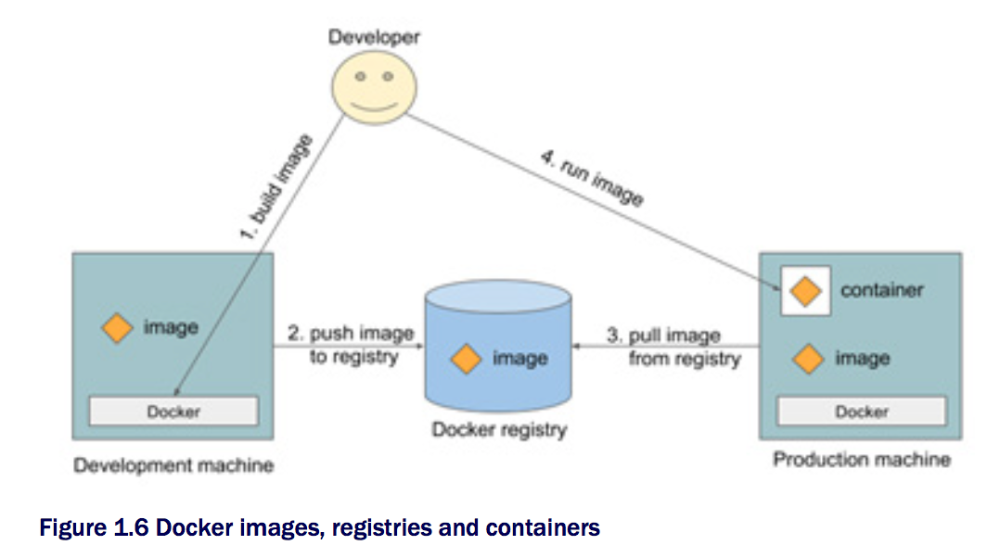

# Chapter 1 - Kubernates 소개

## 1.1 Kubernates와 같은 시스템의 필요성
기존 커다란 단일(Monolithic) 형태의 응용프로그램에서 마이크로서비스(Microservices) 형태로의 변화됨에 따라 인프라 구성 또한 영향을 미치게 되었음.

단일 응용프로그램은 여러 컴포넌트들이 단단히 서로 연결되어져 있으며, 단일 OS 프로세스로서 실행되기때문에 이들은 하나의 개체(Entity)처럼 개발, 배포 그리고 관리되어져야 한다. 또한 이는 각 컴포넌트간 명확한 접점 혹은 종속성 부족으로 인하여, 한 부분의 변경은 모든 재배포를 의미하게된다.

일반적으로 단일 응용프로그램을 실행하기 위해서는 강력한(Powerful) 서버를 필요로 한다. 또한 당신은 증가하는 부하(load)를 견디기 위해서 스케일 업이나 아웃 방식을 이용해야한다. 스케일 업 경우 응용프로그램에 대한 변경이 필요하지 않으나 스케일 아웃 경우는 큰 변경이 따른게 되며, 또한 때로는 변경이 불가능 할 수도 있다.

### 응용프로그램 분리 
여러 문제들은 우리에게 복잡한 단일 응용프로그램을 마이크로서비스라 불리는 여러 작은 배포가능한 독립적 컴포넌트들로 분리하게 만든다. 각각의 마이크로서비스는 독립 프로세스로 실행되며 각 컴포넌트들은 간략하고 잘 정의된 인터페이스를 통하여 서로 통신을 한다. (그림 1.1 참조)

각 마이크로서비스는 독립된 프로세스로 관계적 정적 외부 API(relatively static external API)를 가지고 있어, 이들을 분리하여 개발 및 배포가 가능하다. 

### 스케일링(Scaling)
마이크로서비스는 단일 서비스와 달리 리소스가 필요한 부분만 스케일링을 진행할 수 있다. (그림 1.2 참조)

### 배포(Deploying)
마이크로서비스는 컴포넌트들이 증가함에 따라 이들간의 내부 종속성(inter-dependencies) 또한 증가하기 때문에 배포에 대한 결정이 더욱 어려워지게 된는 문제를 가지고 있다.

### 필요 환경
동적 링크된 응용프로그램이 여러 다른 버전의 공유 라이브러리들나 다양한 종류의 환경을 필요로 하고 이를 한 프로덕션 서버에 배포해야 한다면, 이는 곧시스템 관리자게 있어 악몽과도 같을 것이다. 

## 1.1.1 일관된 환경을 응용프로그램에 제공
운영 환경에서만 나타나는 여러 문제를 줄이기 위해서는 개발 및 운영 단계 모두에서 같은 환경에서 운영을 해야한다. 그러기 위해서는 같은 운영체제, 라이브러리, 시스템 설정, 네트워크 환경 등 모두 같도록 유지해야한다. 
## 1.1.2 지속 배포 및 DevOps
예전에는 개발팀이 응용프로그램을 만들고 이를 운영팀에 전달하며, 운영팀에서는 이를 배포, 운영을 하였다. 최근 조직들은 하나의 팀에서 응용프로그램의 개발, 배포, 운영을 전담하는게 더욱 낫다고 깨달았다. 이말은 결국 개발, QA 그리고 운영팀이 서로 협업이 필요하다는 것을 의미한다.

# 1.2 컨테이너(Container) 기술 소개
## 1.2.1 컨테이너의 이해
- 컨테이너 기술은 여러 서비스들을 각기 다른 환경을 노출시키지 않고 하나의 호스트 머신에서 실행할 수 있도록 해준다. 
- 컨테이너들은 가상 머신과 비교하여 훨씬 더욱 가벼우며, 동일 하드웨어에서 더욱 많은 수의 소프트웨어 컴포넌트들을 실행할 수 있다.

- 가상 머신은 단지 하드웨어만 공유할 뿐 다른 모든 것은 분리되어지는 반면에 컨테이너는 같은 커널을 사용하기 때문에 보안상 문제를 안고 있다.
- 컨테이너는 리눅스 네임스페이스(namespace) 기술을 통하여 프로세스들을 분리(isolate)시킨다.
- 컨테이너는 cgroups 기술을 이용하여 시스템 자원 사용을 한정시킬 수 있다.
## 1.2.2 도커 컨테이너 플랫폼
도커 컨테이너 플랫폼이 널리 알려지면서 기존부터 있어왔던 컨테이너 기술이 더욱 부각되었다. 도커는 각기 다른 머신들에 컨테이너를 쉽게 배포할 수 있도록 만들어졌다. 
도커 통해 패키징된 응용프로그램을 실행하면, 프로덕션이나 개발환경 어느 환경 관계없이 당신은 항상 같은 파일 시스템 내용을 확인할 수 있다.

도커는 응용프로그램들을 패키징, 배포 그리고 실행하기 위한 플랫폼이다.

- **도커 컨테이너 이미지**: 응용프로그램과 환경을 패지징한 것으로 응용프로그램과 다른 메타데이터에게 제공하기위한 파일 시스템을 가진다.
- **도커 레지스트리**: 저장소로 다른 사람과 컴퓨터들 사이에 이 이미지들을 쉽게 공유할 수 있는 곳이다.
- **도커 컨테이너**: 도커 이미지가 실행되고 있는 것을 가르킨다.

도커 이미지는 레이어들로 구성되어지며, 다른 이미지를 통해 만들어지기 때문에 어떤 이미지들은 하나의 동일한 레이어를 가질 수도 있다. 
도커 이미지 레이어들은 읽기 전용이며, 컨테이너가 실행될 경우 최상단 레이어는 쓰기가 가능한 레이어가 생성되게 된다.

# 1.3 Kubernates의 이해
- Kubernates는 소프트웨어 시스템으로 컨테이너화된 응용프로그램을 배포 및 관리를 쉽게 해준다.
- Kubernates는 수천대의 컴퓨터 노드들을 하나의 거대한 컴퓨터인 것인양 당신의 응용프로그램을 실행 할 수 있도록 해준다.  
- Kubernates는 하위의 인프라 구조를 추상화하고 개발자 및 시스템 관리자에게 개발 주기를 단순화 시켜준다.

 

## Kubernates 클러스터의 아키텍처의 이해
Kubernates는 여러개의 노드들고 구성되어지며, 두개의 타입으로 분리할 수 있다.

**Kubernates Control Plane**: 모든 Kubernates시스템 및 노드들을 관리

- API Server: Kubernates 클러스터의 통신과 운영을 담당
- Scheduler: 응용프로그램의 스케쥴링을 담당
- Controller Manager: 클러스터 단계의 기능(컴포넌트의 복제, 작업 노드들의 상태 검사 등)을 수행
- etcd: 신뢰성있는 분산 데이터 저장소로 클러스터 설정을 저장

**Nodes**: 컨테이너화된 응용프로그램을 실행하는 머신들을 가르킴

- 당신의 컨테이너를 실행하는 Docker, rkt 혹은 다른 컨테이너 런타임
- Kubelet: 마스터와의 통신과 노드의 컨테이너들을 관리
- Kube-proxy: 프록시로 당신의 응용프로그램 컴포넌트간의 네트워크 트래픽을 로드 밸런싱 처리

Kubernates를 사용함에 따라 얻는 이점

- 더나은 하드웨어의 사용율 달성
- 상태 검사(Health Checking) 및 자동 복원(Self-healing)
- 자동 확장(Auto-scaling)
- 응용프로그램 개발 단순화

 

