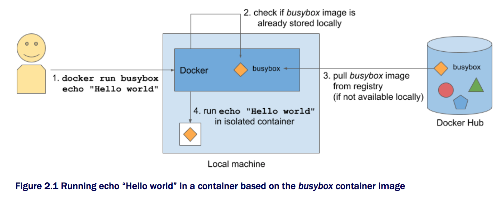
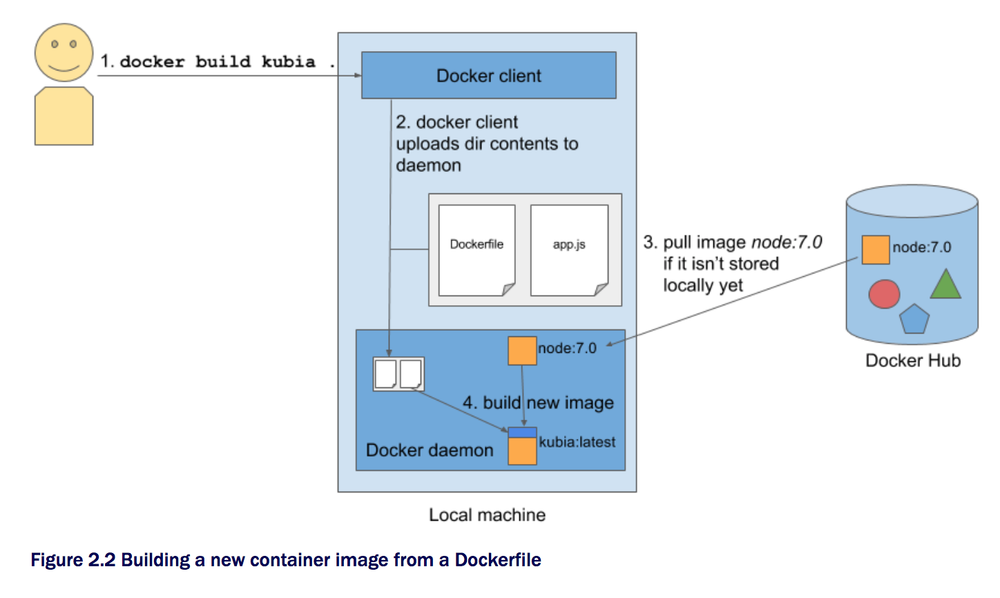
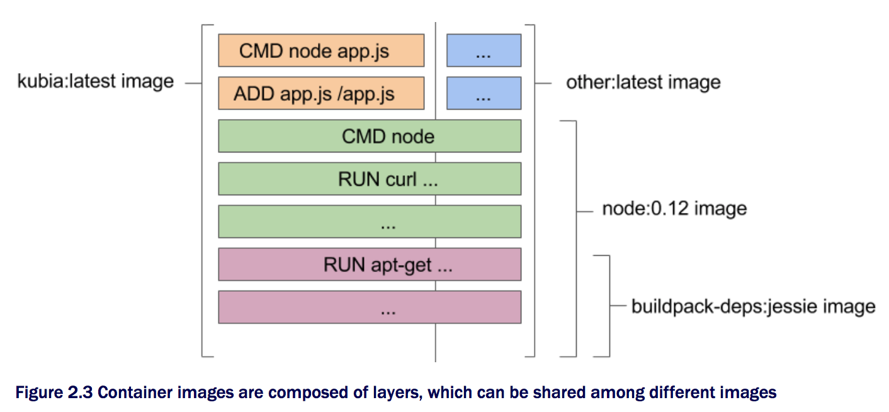
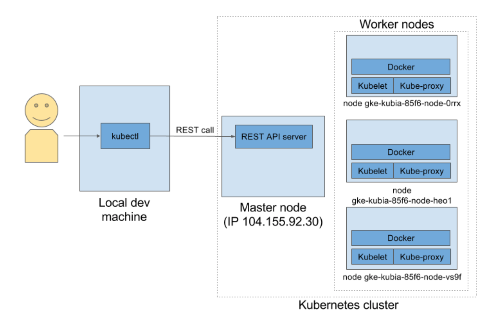

# 2. Docker와 Kubernates 첫 스탭

## 2.1 컨테이너 이미지의 생성/실행/공유
### 2.1.1 Docker 설치 및 Hello World 컨테이너 실행
CentOS 7 환경에서 Docker 설치법

```bash
#!/bin/bash
yum install -y yum-utils device-mapper-persistent-data lvm2
yum-config-manager --add-repo \
  https://download.docker.com/linux/centos/docker-ce.repo
yum makecache fast
yum install docker-ce -y
systemctl start docker
```
Busybox 이미지를 사용한 Hello World 실행

```bash
[root@localhost ~]# docker run busybox echo "Hello World"
Unable to find image 'busybox:latest' locally
latest: Pulling from library/busybox
0ffadd58f2a6: Pull complete
Digest: sha256:bbc3a03235220b170ba48a157dd097dd1379299370e1ed99ce976df0355d24f0
Status: Downloaded newer image for busybox:latest
Hello World
```

#### 동작 원리



### 이미지 실행 방법

```
# docker run <image>
# docker run <image>:<tag>
```

### 2.1.2 간단한 Node.js app 생성 및 

```
[root@localhost ~]# mkdir nodejs_app

[root@localhost ~]# cd nodejs_app
[root@localhost nodejs_app]# cat <<'EOF' > app.js
const http = require('http');
const os = require('os');

console.log("Kubia server starting...");

var handler = function(request, response){
  console.log("Received request from " + request.connection.remoteAddress);
  response.writeHead(200);
  response.end("You've hit " + os.hostname() + "\n");
};

var www = http.createServer(handler)
www.listen(8080);
EOF
```

Node.js 응용프로그램을 실행하기 위해서는 Node.js 런타임이 설치되어있어야한다. 다음은 CentOS 7에서 Node.js를 설치하는 방법이다.

```
# yum install epel-release -y
# yum install nodejs -y
```

다음 명령을 통하여 생성한 app.js를 실행하여 HTTP 서버를 구동시킨다.

```
[root@localhost nodejs_app]# node app.js
Kubia server starting...
``` 
이제 다른 터미널이나 PC에서 해당 서버로 접근해본다.

```
[vagrant@localhost ~]$ curl http://localhost:8080
You've hit localhost.localdomain
```


### 2.1.3 Docker 이미지를 위한 Dockerfile 생성
위에서 생성한 node.js 응용프로그램을 실행하기위해서는 Node.js 런타임 라이브러리가 설치되어있어야 한다.
Docker 컨테이너 이미지를 만든 app.js과 함께 패키징하게되면 이러한 설치과정이 필요없다.

먼저 응용프로그램을 이미지에 패키징하려면 Dockerfile을 먼저 생성하여야 한다.

```
[root@localhost nodejs_app]# cat <<'EOF' > Dockerfile
FROM node:7
ADD app.js /app.js
CMD node app.js
EOF
```

### 2.1.4 컨테이너 이미지 빌드하기

```
[root@localhost nodejs_app]# docker build -t kubia .
```

```
[root@localhost nodejs_app]# docker build -t kubia .
Sending build context to Docker daemon  3.072kB
Step 1/3 : FROM node:7
7: Pulling from library/node
ad74af05f5a2: Pull complete
2b032b8bbe8b: Pull complete
a9a5b35f6ead: Pull complete
3245b5a1c52c: Pull complete
afa075743392: Pull complete
9fb9f21641cd: Pull complete
3f40ad2666bc: Pull complete
49c0ed396b49: Pull complete
Digest: sha256:af5c2c6ac8bc3fa372ac031ef60c45a285eeba7bce9ee9ed66dad3a01e29ab8d
Status: Downloaded newer image for node:7
 ---> d9aed20b68a4
Step 2/3 : ADD app.js /app.js
 ---> 3ef9f9b2a1b2
Removing intermediate container 59f58c42b7a9
Step 3/3 : CMD node app.js
 ---> Running in 58c4558cdd1a
 ---> ea7048f17f9f
Removing intermediate container 58c4558cdd1a
Successfully built ea7048f17f9f
Successfully tagged kubia:latest
```


**이미지 레이어의 이해**



다음 커맨드를 통하여 현 시스템에 설치된 컨테이너 이미지를 확인할 수 있다.

```
[root@localhost nodejs_app]# docker images
REPOSITORY                    TAG                 IMAGE ID            CREATED             SIZE
kubia                         latest              ea7048f17f9f        3 minutes ago       660MB
busybox                       latest              6ad733544a63        9 days ago          1.13MB
```

### 2.1.5 컨테이너 이미지 실행하기
```
# docker run --name kubia-container -p 8080:8080 -d kubia
```
kubia이미지를 사용하여 kubia-container라는 이름으로 Docker를 실행하라는 명령으로 각 옵션의 의미는 다음과 같다

* --name kubia-container | 컨테이너의 이름을 kubia-container로 지정하라는 의미
* -d | Backgroud로 실행 -> console을 분리(detach)하라는 의미
* -p 8080:8080 | 로컬 8080 포트를 내부 컨테이너의 8080 포트에 맵핑하라는 의미

**응용프로그램의 접근**
이제 백그라운드로 실행한 docker 컨테이너에 접근해보자. 
다음 실행 결과를보면 호스트이름이 현재 시스템 호스트이름이 아닌 컨테이너의 ID값인 11c1d0806a41가 반환된 것을 볼 수 있다.

```
[root@localhost nodejs_app]# curl localhost:8080
You've hit 11c1d0806a41
```

**실행되고 있는 모든 컨테이너 리스팅하기**

```
# docker ps
```
```
[root@localhost nodejs_app]# docker ps
CONTAINER ID        IMAGE               COMMAND                  CREATED             STATUS              PORTS                    NAMES
11c1d0806a41        kubia               "/bin/sh -c 'node ..."   6 minutes ago       Up 6 minutes        0.0.0.0:8080->8080/tcp   kubia-container
```

**컨테이너의 자세한 정보 확인하기** 

```
# docker inspect kubia-container
```

### 2.1.6 실행 중인 컨테이너 내부 보기

**현 컨테이너의 쉘 실행**

전에 생성한 node.js 이미지에는 bash 쉘을 포함하고 있음으로 다음 명령으로 쉘을 실행 할 수 있다.

```
# docker exec -t kubia-container bash
```

위 명령은 kubia-container 컨테이너 내의 bash를 실행시킨다. 이 bash 프로세스는 메인 컨테이너 프로세스와 같은 네임스페이스를 가진다.
이로 인하여 우리는 Node.js와 우리가 생성한 응용프로그램이 어떻게 컨테이너 내부에서 실행됨을 알 수가 있다.

* -i: STDIN을 계속 유지
* -t: 가상 터미널(TTY) 할당

**컨테이너 내부 확인**

```
root@11c1d0806a41:/# ps aux
USER       PID %CPU %MEM    VSZ   RSS TTY      STAT START   TIME COMMAND
root         1  0.0  0.0   4328   656 ?        Ss   10:17   0:00 /bin/sh -c node app.js
root         5  0.2  0.8 614424 16420 ?        Sl   10:17   0:00 node app.js
root        11  0.0  0.1  20236  1980 pts/0    Ss   10:18   0:00 bash
root        16  0.0  0.0  17492  1136 pts/0    R+   10:18   0:00 ps aux
root@11c1d0806a41:/#
```
실행 결과를 보면 단지 4개의 프로세스들만 보이고, 호스트 OS의 다른 프로세스들은 보이지 않음을 알 수 있다.

**호스트 OS에서 실행되는 컨테이너의 프로세스 확인**

```
[root@localhost ~]# ps aux |grep app.js | grep -v 'grep'
root      2974  0.0  0.0   4328   656 ?        Ss   10:17   0:00 /bin/sh -c node app.js
root      3001  0.0  0.8 614424 16420 ?        Sl   10:17   0:00 node app.js
```
컨테이너에서 실행되고 있는 프로세스들은 결국 호스트 OS에서 실행되고 있음을 확인할 수 있다. 그런데 자세히보면 프로세스 ID가 다름을 볼 수 있는데,
이는 컨테이너 자체 적으로 별도의 PID 네임스페이스를 사용하고 있음에 따라 완전히 독립된 프로세스 트리가지게되고 다른 프로세스 순번을 가지게 되는 것이다.

```
[root@localhost ~]# docker exec -it kubia-container ps aux | grep node
root         1  0.0  0.0   4328   656 ?        Ss   10:17   0:00 /bin/sh -c node
root         5  0.0  0.8 614424 16420 ?        Sl   10:17   0:00 node app.js
[root@localhost ~]# ps aux |grep node | grep -v 'grep'
root      2974  0.0  0.0   4328   656 ?        Ss   10:17   0:00 /bin/sh -c node app.js
root      3001  0.0  0.8 614424 16420 ?        Sl   10:17   0:00 node app.js
```

**독립된 컨테이너의 파일시스템**

```
root@11c1d0806a41:/# ls /
app.js	bin  boot  dev	etc  home  lib	lib64  media  mnt  opt	proc  root  run  sbin  srv  sys  tmp  usr  var
```

### 2.1.7 컨테이너의 종료 및 삭제

```
docker stop kubia-container
```

ps -a 옵션을 사용할 경우 해당 컨테이너가 종료되었으나 여전히 시스템에 남아있음을 확인할 수 있다.

```
[root@localhost ~]# docker ps
CONTAINER ID        IMAGE               COMMAND             CREATED             STATUS              PORTS               NAMES
[root@localhost ~]# docker ps -a
CONTAINER ID        IMAGE               COMMAND                  CREATED             STATUS                       PORTS               NAMES
11c1d0806a41        kubia               "/bin/sh -c 'node ..."   4 days ago          Exited (137) 2 minutes ago                       kubia-container
d5a881906cb7        busybox             "echo 'Hello World'"     4 days ago          Exited (0) 4 days ago                            hungry_colden
```

남아있는 컨테이너는 **docker rm** 명령을 통하여 완전히 삭제 시킬 수 있다.

```
[root@localhost ~]# docker rm kubia-container
kubia-container
[root@localhost ~]# docker ps -a
CONTAINER ID        IMAGE               COMMAND                  CREATED             STATUS                      PORTS               NAMES
d5a881906cb7        busybox             "echo 'Hello World'"     4 days ago          Exited (0) 4 days ago                           hungry_colden
```

### 2.1.7 이미지 레지스트리에 컨테이너 이미지 올리기
생성한 이미지를 다른 시스템에서 사용하기 위해서는 시스템들이 엑세스 할 수 있는 외부 이미지 레지스트리에 이미지를 먼저 등록해야한다.
레지스트리에 등록을 하기 위해서는 먼저 올리려는 컨테이너 이미지에 태그를 달아야 한다. 본 예제에서는 daehyung/kubia에 kubia 태그를 달았다(daehyung 대신 자신의 Docker Hub의 ID를 사용한다).

**이미지에 태그(Tag) 추가하기**

```
[root@localhost ~]# docker images
REPOSITORY                    TAG                 IMAGE ID            CREATED             SIZE
kubia                         latest              ea7048f17f9f        4 days ago          660MB
...SNIP...
[root@localhost ~]# docker tag kubia daehyung/kubia
``` 

**Docker Hub 로그인**

```
[root@localhost ~]# docker login
Login with your Docker ID to push and pull images from Docker Hub. If you don't have a Docker ID, head over to https://hub.docker.com to create one.
Username: daehyung
Password:
Login Succeeded
```

**이미지 올리기**

```
[root@localhost ~]# docker push daehyung/kubia
The push refers to a repository [docker.io/daehyung/kubia]
24db31c42e1d: Pushed
ab90d83fa34a: Pushed
8ee318e54723: Pushed
e6695624484e: Pushed
da59b99bbd3b: Pushed
5616a6292c16: Pushed
f3ed6cb59ab0: Pushed
654f45ecb7e3: Pushed
2c40c66f7667: Pushed
latest: digest: sha256:1bdbf39903764c5132da5e5a71c4a14bf005c633c8caee4f29d70b07f3c29867 size: 2213
```

**다른 시스템에서 이미지 실행하기**

```
[root@localhost ~]# docker run -p 8080:8080 -d daehyung/kubia
73409f39c1485d0999f828e153b33d174b4deeb80313cd65197809ef6eb9cf77
[root@localhost ~]# docker ps
CONTAINER ID        IMAGE               COMMAND                  CREATED             STATUS              PORTS                    NAMES
73409f39c148        daehyung/kubia      "/bin/sh -c 'node ..."   6 seconds ago       Up 6 seconds        0.0.0.0:8080->8080/tcp   focused_nobel
```
## 2.2 Kubernates 클러스터 설정 ##

숙련된 리눅스와 네트워크 관리자가 아니라면 완벽한 멀티 노드 Kubernates 클러스터를 배포하기란 쉽지 않다. Kubernates는 단일화된(flat) 네트워크 공간을 통해 내부의 모든 컨테이너들이 연결될 수 있도록 하기 위해, 적절한 네트워크 설정을 요구하며, 여러 물리 혹은 가상 머신에 걸쳐 설치하게된다.
Kubernates 클러스터 설치는 매우 길고 다양한 방법들이 존재한다. 자세한 문서는 http://kubernates.io 에 소개하고 있다.

> 책에서는 로컬머신에 Single-Node Kubernates 클러스터와 Google Container Engine(GKE)에 설치하는 법이 기술되어있으나 여기에서는 Appendix B에 소개하고 있는 kubeadmin 툴을 통하여 설치하는 법만 포함하도록 한다.


## Kubernates 클러스터 테스팅 환경 구성하기

### kubeadm을 이용한 multi node cluster 테스트 환경 구성하기 

#### Vagrant 테스트 설정 clone하기

테스트를 위해 만들어놓은 Vagrant 설정 파일을 github 저
장소에서 가져와 실행하도록 한다.
> 제공된 Vagrant 설정 파일을 제대로 사용하기 위해서는 Vagrant 소프트웨어와 Vagrant plugin 인 hostmanager가 설치되어있어야 한다.

```
git clone https://github.com/netman2k/Kubernates_in_action 
cd Kubernates_in_action/Kubernates_Cluster
```

#### 노드 VM 시작시키기

```
$ vagrant up
```

#### kubeadm을 통한 Kubernates Cluster 초기화하기

Vagrant를 이용하여 Private network을 Default로 사용할 경우 다음과 같이 해당 Master VM의 Private network IP를 명시해주어야한다. 그렇지 않을 경우 NAT 네트워크의 IP가 자동으로 할당되게된다.
또한 조금 후에 설치할 컨테이너 네트워크 인터페이스(CNI)를 위해 pod-network-cide을 같이 설정해 주어야한다. 여기서는 간단히 10.0.0.0/24를 설정하였다.

기본적으로  kubeadm을 통하여 초기화를 시도할 경우 시스템 환경을 확인하는데 이때 시스템의 Swap이 활성화되어있을 경우 다음과 같은 오류가 발생되며 설치가 되지 않는다.
 
```
[root@k8s-master ~]# kubeadm init --apiserver-advertise-address 10.0.0.21 --pod-network-cidr=10.0.0.0/24
[kubeadm] WARNING: kubeadm is in beta, please do not use it for production clusters.
[init] Using Kubernetes version: v1.8.4
[init] Using Authorization modes: [Node RBAC]
[preflight] Running pre-flight checks
[preflight] Some fatal errors occurred:
	running with swap on is not supported. Please disable swap
[preflight] If you know what you are doing, you can skip pre-flight checks with `--skip-preflight-checks`
```

Swap 비활성화 후 초기화를 다시 진행하면 다음과 같은 메시지를 볼 수 있다. 여기서 맨 마지막 줄에 출력되는 정보를 잘 기록해둔다.

```
[root@k8s-master ~]# swapoff -a
[root@k8s-master ~]# kubeadm init --apiserver-advertise-address 10.0.0.21 --pod-network-cidr=10.0.0.0/24
[kubeadm] WARNING: kubeadm is in beta, please do not use it for production clusters.
[init] Using Kubernetes version: v1.8.4
[init] Using Authorization modes: [Node RBAC]
[preflight] Running pre-flight checks
[kubeadm] WARNING: starting in 1.8, tokens expire after 24 hours by default (if you require a non-expiring token use --token-ttl 0)
...SNIP...
You can now join any number of machines by running the following on each node
as root:

  kubeadm join --token 139f8e.2bcd3e6d929b7585 10.0.0.21:6443 --discovery-token-ca-cert-hash sha256:b15b060be6e18b84ab2da9e3e1f39ed8a1cd1b35ea584cd3db922cfd80324a5b
```

#### kubectl을 사용하기위한 환경설정

다음 명령을 사용하여 kubectl 명령을 사용할 수 있게 환경을 설정해준다.

```
mkdir -p $HOME/.kube
sudo cp -i /etc/kubernetes/admin.conf $HOME/.kube/config
sudo chown $(id -u):$(id -g) $HOME/.kube/config
```
root유저의 경우 다음과 같이 사용할 수도 있다.

```
export KUBECONFIG=/etc/kubernetes/admin.conf
```

#### 노드 추가하기

최초 초기화시 표시되었던 명령을 이용하여 노드를 클러스터에 추가해준다.
다음은 사용 예이니 꼭 kubectl init 명령을 통해 출력된 명령을 이용한다. 이 때 Token을 읽어버렸다면 다음 명령으로 확인할 수 있다.

```
[root@k8s-master ~]# kubeadm token list
TOKEN                     TTL       EXPIRES                USAGES                   DESCRIPTION                                                EXTRA GROUPS
527e2d.2ff7fecef350692d   23h       2017-11-25T12:09:10Z   authentication,signing   The default bootstrap token generated by 'kubeadm init'.   system:bootstrappers:kubeadm:default-node-token
```

이제 노드를 클러스터에 등록시켜보도록 한다.

```
[root@node1 ~]# swapoff -a
[root@node1 ~]# kubeadm join --token 139f8e.2bcd3e6d929b7585 10.0.0.21:6443 --discovery-token-ca-cert-hash sha256:b15b060be6e18b84ab2da9e3e1f39ed8a1cd1b35ea584cd3db922cfd80324a5b
[kubeadm] WARNING: kubeadm is in beta, please do not use it for production clusters.
[preflight] Running pre-flight checks
[discovery] Trying to connect to API Server "10.0.0.21:6443"
[discovery] Created cluster-info discovery client, requesting info from "https://10.0.0.21:6443"
[discovery] Requesting info from "https://10.0.0.21:6443" again to validate TLS against the pinned public key
[discovery] Cluster info signature and contents are valid and TLS certificate validates against pinned roots, will use API Server "10.0.0.21:6443"
[discovery] Successfully established connection with API Server "10.0.0.21:6443"
[bootstrap] Detected server version: v1.8.4
[bootstrap] The server supports the Certificates API (certificates.k8s.io/v1beta1)

Node join complete:
* Certificate signing request sent to master and response
  received.
* Kubelet informed of new secure connection details.

Run 'kubectl get nodes' on the master to see this machine join.
``` 

#### 노드 확인하기

노드가 정상적으로 클러스터에 등록이되었는지 확인을 하기위해 다음 명령을 마스터 노드에서 실행해본다. 아래 예에서는 node1.k8s 노드가 추가되었음을 확인할 수 있다. 

```
[root@k8s-master ~]# kubectl get node
NAME         STATUS     ROLES     AGE       VERSION
k8s-master   NotReady   master    20m       v1.8.4
node1.k8s    NotReady   <none>    3m        v1.8.4
```

나머지 노드도 같은 방식으로 추가해주도록 한다.

#### calico container network 설치하기
Kubernates를 지원하는 컨테이너 네트워크 목록은 다음 URL에서 확인할 수 있다.

> http://kubernetes.io/docs/admin/addons/

여기서는 Calico 설치하는 방법만 기술한다.

#### 노드 확인

두 노드를 클러스터에 등록한 후 노드를 확인해보면 다음과같이 STATUS가 NotReady로 보일 것이다. 그 이유는 아직 컨테이너 네트워크(CNI) 플러그인을 설치하지 않았기때문이다. 


```
[root@k8s-master ~]# kubectl get node
NAME         STATUS     ROLES     AGE       VERSION
k8s-master   NotReady   master    27m       v1.8.4
node1.k8s    NotReady   <none>    10m       v1.8.4
node2.k8s    NotReady   <none>    2s        v1.8.4
```
> KubeletNotReady              runtime network not ready: NetworkReady=false reason:NetworkPluginNotReady message:docker: network plugin is not ready: cni config uninitialized
다음 명령을 사용하여 Calico를 설치한 후 다시 노드를 확인해보자.

```
kubectl apply -f https://docs.projectcalico.org/v2.6/getting-started/kubernetes/installation/hosted/kubeadm/1.6/calico.yaml
```

일정 시간이 지난 후 다시 확인을 해보면 다음과 같이 STATUS가 Ready로 변경되었음을 확인할 수 있다.

```
[root@k8s-master ~]# kubectl get node
NAME         STATUS    ROLES     AGE       VERSION
k8s-master   Ready     master    32m       v1.8.4
node1.k8s    Ready     <none>    14m       v1.8.4
node2.k8s    Ready     <none>    4m        v1.8.4
```

자세한 POD 정보를 확인해보면 Calico 플러그인 여러개가 생성되었음을 확인할 수 있다.

```
[root@k8s-master ~]# kubectl get pod --all-namespaces
NAMESPACE     NAME                                       READY     STATUS    RESTARTS   AGE
kube-system   calico-etcd-2gwzd                          1/1       Running   0          1m
kube-system   calico-kube-controllers-55449f8d88-9b7fw   1/1       Running   0          1m
kube-system   calico-node-htd5n                          2/2       Running   0          1m
kube-system   calico-node-jm8p8                          2/2       Running   0          1m
kube-system   calico-node-n4pl9                          2/2       Running   0          1m
kube-system   etcd-k8s-master                            1/1       Running   0          32s
kube-system   kube-apiserver-k8s-master                  1/1       Running   0          32s
kube-system   kube-controller-manager-k8s-master         1/1       Running   0          32s
kube-system   kube-dns-545bc4bfd4-gs8lh                  3/3       Running   0          22m
kube-system   kube-proxy-4swk2                           1/1       Running   0          4m
kube-system   kube-proxy-ddxdx                           1/1       Running   0          16m
kube-system   kube-proxy-gz22v                           1/1       Running   0          22m
kube-system   kube-scheduler-k8s-master                  1/1       Running   0          32s
```

#### 로컬 머신에서 Cluster 사용하기

로컬 머신에서 클러스터를 사용하기 위해서는 먼저 kubectl을 로컬머신에 설치한다.

> 자세한 설치법은 다음 페이지에서 확인한다.
> https://kubernetes.io/docs/tasks/tools/install-kubectl/
>  

다음 커맨드는 kubectl을 macOS에 설치하는 방법이다.

```
$ curl -LO https://storage.googleapis.com/kubernetes-release/release/`curl -s https://storage.googleapis.com/kubernetes-release/release/stable.txt`/bin/darwin/amd64/kubectl
$ chmod +x kubectl
$ sudo mv ./kubectl /usr/local/bin/kubectl
```

다음으로 마스터 노드에서 /etc/kubernates/admin.conf 파일을 가져와 마스터 노드에서 한 것처럼 특정 위치에 파일을 위치시키거나 KUBECONFIG 환경설정을 이용하여 kubectl을 이용할 수 있도록 한다.

```
$ export KUBECONFIG=<File location>/admin.conf
```

#### kubectl을 통한 클러스터 동작 확인

**kubectl cluster-info** 명령을 통해 클러스터가 동작되는 것을 확인할 수 있다.

```
$ kubectl cluster-info
Kubernetes master is running at https://10.0.0.21:6443
KubeDNS is running at https://10.0.0.21:6443/api/v1/namespaces/kube-system/services/kube-dns/proxy

To further debug and diagnose cluster problems, use 'kubectl cluster-info dump'.
```

### minikube로 테스팅 환경 구성하기
minikube는 Kubernates를 로컬에서 실행하기 쉽도록해주는 도구이다.
minikube는 단일 노드 Kubernates 클러스터를 로컬 머신의 VM에서 실행하게해준다. 

**macOS에서 설치하기**

```
$ brew cask install minikube
$ minikube start
$ kubectl get node
NAME       STATUS    ROLES     AGE       VERSION
minikube   Ready     <none>    3m        v1.8.0
```
자세한 사항은 다음 링크에가서 확인한다.

[minikube github](https://github.com/kubernetes/minikube)


## 클러스터 개요



위 이미지는 우리에게 클러스터가 어떻게 생겼으며 어떻게 상호작용하는지에 대해 보여준다. 각 노드는 kubelet과 kube-proxy Docker 컨테이너들을 실행하며, 사용자는 kubectl 커맨드 라인 클라이언트를 통해 마스터 노드에서 실행되고 있는 Kubernates REST API 서버에게 REST 요청을 하는 것을 보여주고있다.  

### 클러스터 내 노드 확인

다음 명령을 통해 클러스터 내의 노드들을 확인할 수 있다.

```
$ kubectl get nodes
NAME         STATUS    ROLES     AGE       VERSION
k8s-master   Ready     master    2d        v1.8.4
node1.k8s    Ready     <none>    2d        v1.8.4
node2.k8s    Ready     <none>    2d        v1.8.4
```

### 오브젝트의 자세한 정보 확인

다음 명령을 통해 노드의 자세한 정보를 확인할 수 있으며, **kubectl describe node** 와 같이 모든 노드의 정보를 확인 할 수도 있다.

```
$ kubectl describe node node2.k8s
```


## Kubernates에서 첫번째 app 실행하기

앞에서 Docker Hub에 올린 kubia를 Kubernates에서 실행해보자.

```
$ kubectl run kubia --image=daehyung/kubia --port=8080 --generator=run/v1
```

* --image=daehyung/kubia: 실행할 컨테이너 이미지
* --port=8080: 리스닝할 Port 번호
* --generator: deployment 대신 Replication Controller를 사용

## PODS
