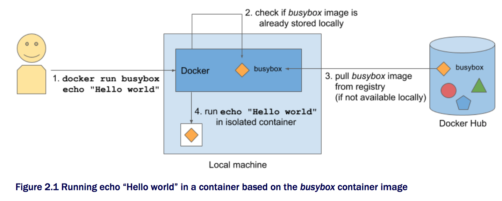

# 2. Docker와 Kubernates 첫 스탭

## 2.1 컨테이너 이미지의 생성/실행/공유
### 2.1.1 Docker 설치 및 Hello World 컨테이너 실행
CentOS 7 환경에서 Docker 설치법

```bash
#!/bin/bash
yum install -y yum-utils device-mapper-persistent-data lvm2
yum-config-manager --add-repo \
  https://download.docker.com/linux/centos/docker-ce.repo
yum makecache fast
yum install docker-ce -y
systemctl start docker
```
Busybox 이미지를 사용한 Hello World 실행

```bash
[root@localhost ~]# docker run busybox echo "Hello World"
Unable to find image 'busybox:latest' locally
latest: Pulling from library/busybox
0ffadd58f2a6: Pull complete
Digest: sha256:bbc3a03235220b170ba48a157dd097dd1379299370e1ed99ce976df0355d24f0
Status: Downloaded newer image for busybox:latest
Hello World
```

#### 동작 원리



### 이미지 실행 방법

```
# docker run <image>
# docker run <image>:<tag>
```

### 2.1.2 간단한 Node.js app 생성 및 

```
[root@localhost ~]# mkdir nodejs_app

[root@localhost ~]# cd nodejs_app
[root@localhost nodejs_app]# cat <<'EOF' > app.js
const http = require('http');
const os = require('os');

console.log("Kubia server starting...");

var handler = function(request, response){
  console.log("Received request from " + request.connection.remoteAddress);
  response.writeHead(200);
  response.end("You've hit " + os.hostname() + "\n");
};

var www = http.createServer(handler)
www.listen(8080);
EOF
```

Node.js 응용프로그램을 실행하기 위해서는 Node.js 런타임이 설치되어있어야한다. 다음은 CentOS 7에서 Node.js를 설치하는 방법이다.

```
# yum install epel-release -y
# yum install nodejs -y
```

다음 명령을 통하여 생성한 app.js를 실행하여 HTTP 서버를 구동시킨다.

```
[root@localhost nodejs_app]# node app.js
Kubia server starting...
``` 
이제 다른 터미널이나 PC에서 해당 서버로 접근해본다.

```
[vagrant@localhost ~]$ curl http://localhost:8080
You've hit localhost.localdomain
```


### 2.1.3 Docker 이미지를 위한 Dockerfile 생성
위에서 생성한 node.js 응용프로그램을 실행하기위해서는 Node.js 런타임 라이브러리가 설치되어있어야 한다.
Docker 컨테이너 이미지를 만든 app.js과 함께 패키징하게되면 이러한 설치과정이 필요없다.

먼저 응용프로그램을 이미지에 패키징하려면 Dockerfile을 먼저 생성하여야 한다.

```
[root@localhost nodejs_app]# cat <<'EOF' > Dockerfile
FROM node:7
ADD app.js /app.js
CMD node app.js
EOF
```

### 2.1.4 컨테이너 이미지 빌드하기

```
[root@localhost nodejs_app]# docker build -t kubia .
```

```
[root@localhost nodejs_app]# docker build -t kubia .
Sending build context to Docker daemon  3.072kB
Step 1/3 : FROM node:7
7: Pulling from library/node
ad74af05f5a2: Pull complete
2b032b8bbe8b: Pull complete
a9a5b35f6ead: Pull complete
3245b5a1c52c: Pull complete
afa075743392: Pull complete
9fb9f21641cd: Pull complete
3f40ad2666bc: Pull complete
49c0ed396b49: Pull complete
Digest: sha256:af5c2c6ac8bc3fa372ac031ef60c45a285eeba7bce9ee9ed66dad3a01e29ab8d
Status: Downloaded newer image for node:7
 ---> d9aed20b68a4
Step 2/3 : ADD app.js /app.js
 ---> 3ef9f9b2a1b2
Removing intermediate container 59f58c42b7a9
Step 3/3 : CMD node app.js
 ---> Running in 58c4558cdd1a
 ---> ea7048f17f9f
Removing intermediate container 58c4558cdd1a
Successfully built ea7048f17f9f
Successfully tagged kubia:latest
```


**이미지 레이어의 이해**


다음 커맨드를 통하여 현 시스템에 설치된 컨테이너 이미지를 확인할 수 있다.

```
[root@localhost nodejs_app]# docker images
REPOSITORY                    TAG                 IMAGE ID            CREATED             SIZE
kubia                         latest              ea7048f17f9f        3 minutes ago       660MB
busybox                       latest              6ad733544a63        9 days ago          1.13MB
```

### 2.1.5 컨테이너 이미지 실행하기
```
# docker run --name kubia-container -p 8080:8080 -d kubia
```
kubia이미지를 사용하여 kubia-container라는 이름으로 Docker를 실행하라는 명령으로 각 옵션의 의미는 다음과 같다

* --name kubia-container | 컨테이너의 이름을 kubia-container로 지정하라는 의미
* -d | Backgroud로 실행 -> console을 분리(detach)하라는 의미
* -p 8080:8080 | 로컬 8080 포트를 내부 컨테이너의 8080 포트에 맵핑하라는 의미

**응용프로그램의 접근**
이제 백그라운드로 실행한 docker 컨테이너에 접근해보자. 
다음 실행 결과를보면 호스트이름이 현재 시스템 호스트이름이 아닌 컨테이너의 ID값인 11c1d0806a41가 반환된 것을 볼 수 있다.

```
[root@localhost nodejs_app]# curl localhost:8080
You've hit 11c1d0806a41
```

**실행되고 있는 모든 컨테이너 리스팅하기**

```
# docker ps
```
```
[root@localhost nodejs_app]# docker ps
CONTAINER ID        IMAGE               COMMAND                  CREATED             STATUS              PORTS                    NAMES
11c1d0806a41        kubia               "/bin/sh -c 'node ..."   6 minutes ago       Up 6 minutes        0.0.0.0:8080->8080/tcp   kubia-container
```

**컨테이너의 자세한 정보 확인하기** 

```
# docker inspect kubia-container
```